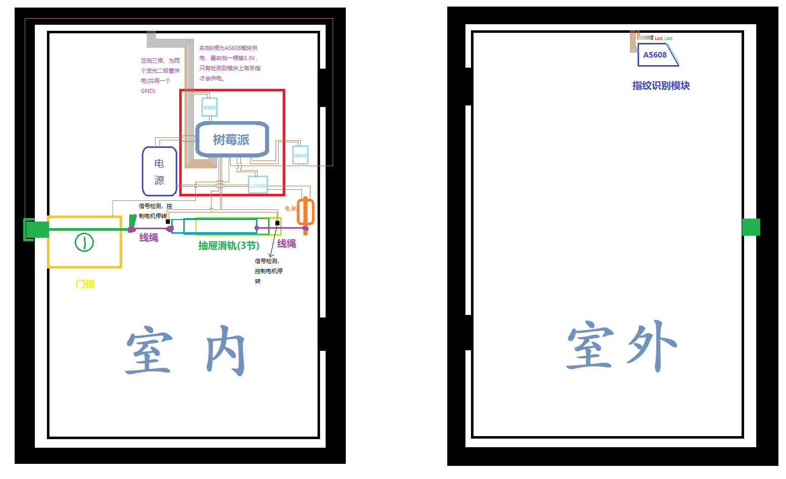
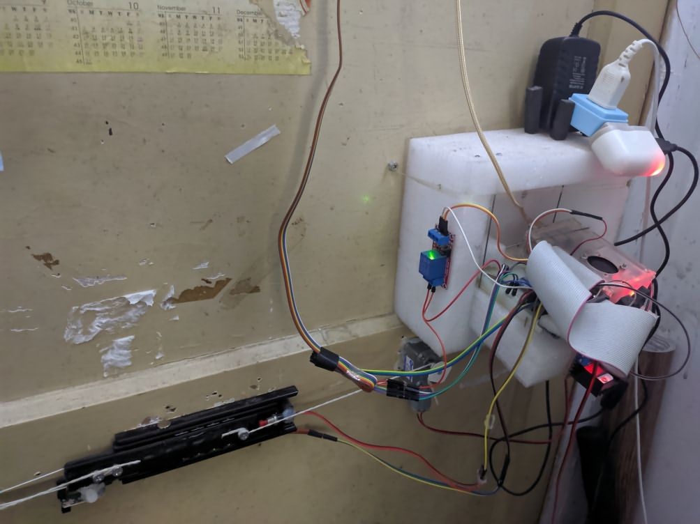
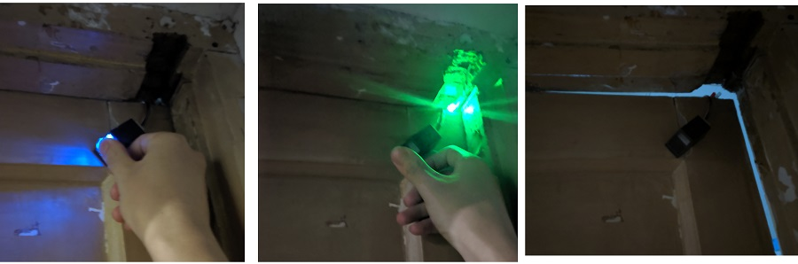

## OpenTheDoor

## 一、简介

基于树莓派3的寝室门禁系统，包括指纹识别开门、web请求开门。整个系统使用C++开发。

## 二、功能与特点

+ 开门方式
  + 指纹识别开门
  + web请求(http/https，自动进行内网穿透，通过公网服务器/域名访问)
+ 通知（开门后每个寝室成员会收到通知）
  + 微信实时通知
+ 系统每天23:23自动关机，第二天6:30自动启动。

## 三、设计图

这是【最初版本】，现在有些变化，加了一些模块，但基本原理不变。

## 四、其他图

一个简易的网页，三个按钮

+ 开门
+ 设置token
+ 生成临时开门链接（指定使用次数和失效时间，在学校应该用不到这个功能的）

## 五、系统运行的基础与依赖

### 1. 自动登陆校园网

树莓派启动后，自动连上校园网，但是需要自动登陆。

参见我的另一个项目：[Leopard-C](https://github.com/Leopard-C)/**[WHU-Net-AutoLogin](https://github.com/Leopard-C/WHU-Net-AutoLogin)**

### 2. service & timer

即Linux系统的service文件和timer文件。

包括，进行内网穿透、启动服务端和客户端(指纹识别)。

### 3. 定时关机

寝室每天23:30自动关机，因此树莓派设置为每天23:23关机。由于树莓派的供电特性，第二天早上，一来电，树莓派就会启动。

### ~~4. QQ机器人~~ （已死，可惜了）

+  ~~<a href="https://cqp.me/user" target="_blank">CoolQ</a>~~

+ ~~[richardchien](https://github.com/richardchien)/[coolq-http-api~~](https://github.com/richardchien/coolq-http-api)

~~在公网服务器【linux】上运行 https://hub.docker.com/r/coolq/wine-coolq/ ，使用`screen`或`tmux`工具管理会话，保证其7x24小时在后台运行。~~

~~然后需要自己写个服务器，用于接收并解析消息。~~

~~PS. 目前支持的命令有~~

+ ~~`ic open` 开门~~
+ ~~`ic weather(或ic tq)`获取3天内的天气（每天早上自动通知）~~

### 5. 内网穿透：`frp`工具

校园网属于内网，部署在内网的服务无法被外网所访问。故需要进行内网穿透，即通过一台具有公网ip的服务器做代理。

[fatedier](https://github.com/fatedier)/**[frp](https://github.com/fatedier/frp)**

### 6. Https证书

~~开发小程序，请求协议必须是`Https`，不支持`Http`。因此服务器是基于`Https`的。~~

阿里云、腾讯云都提供免费证书服务。

## 六、系统的具体实现

### 1. 类

所有的硬件都封装为类。即

+ FpModule: AS608模块
+ Led: Led灯
+ Motor：电动机

其他类：

+ WxNotifier: 通知类，用于微信通知
+ Client：基于libcurl封装的http(s)请求类

### 2. 指纹识别

使用`AS608`模块，通过串口与树莓派通信。

参见我的另一个项目：[Leopard-C](https://github.com/Leopard-C)/**[AS608](https://github.com/Leopard-C/AS608)**

由于AS608的灯一直亮着，而其又提供了一个pin用来判断模块上是否有手指。因此，我又加了一个自动断电、供电的功能，即没有指纹时灯是熄灭的，一检测到指纹，就供电，然后开始识别。从供电到开始工作，延时小于1s。

### 3. CS模式

客户端[door_client]负责指纹识别，服务端[door_server]负责开门。

door_client识别到正确的指纹，会向door_server发送Http请求（**服务端监听的是127.0.0.1，至于通过公网访问，是frp和nginx的转发。因此指纹识别客户端和服务器通信是不依赖于网络的，一定程度上提高了系统的可用性。**）。

## 七、声明

项目中使用了以下库或代码

### 1. Jsoncpp

### 2. libcurl 

### 3. spdlog 日志库

## END

<leopard.c@outlook.com>